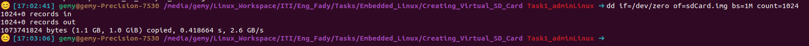
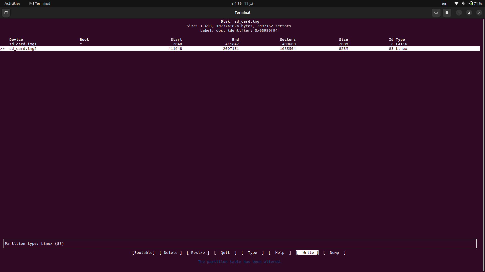
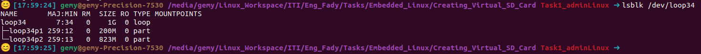
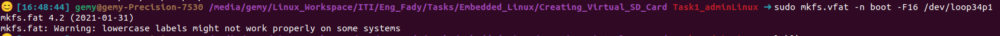
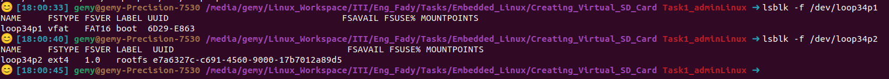
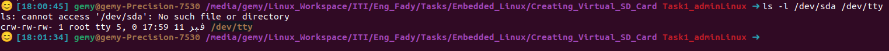
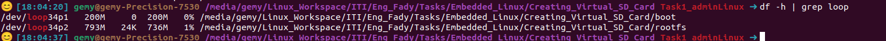
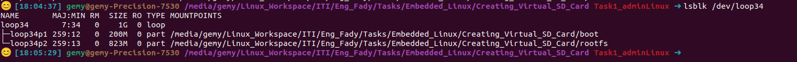

# Embedded Linux Lab 2: Creating a Virtual SD Card

---

## Table of Contents

1. [Create Virtual Disk Image](#1-create-virtual-disk-image)
2. [DOS/MBR vs GPT](#2-dosmbr-vs-gpt)
3. [File Systems](#3-file-systems)
4. [Partition the Virtual Disk](#4-partition-the-virtual-disk)
5. [Loop Devices](#5-loop-devices)
6. [Check Loop Device Limit](#6-check-loop-device-limit)
7. [Expand Loop Devices](#7-expand-loop-devices)
8. [Attach Virtual Disk as Loop Device](#8-attach-virtual-disk-as-loop-device)
9. [Format Partitions](#9-format-partitions)
10. [Mount and Umount Commands](#10-mount-and-umount-commands)
11. [Block vs Character Devices](#11-block-vs-character-devices)
12. [Create Mount Points and Mount Partitions](#12-create-mount-points-and-mount-partitions)

---

# 1. Create Virtual Disk Image

## Command:

```bash
dd if=/dev/zero of=sd_card.img bs=1M count=1024
```

## Explanation:

| Parameter        | Meaning                            |
| ---------------- | ---------------------------------- |
| `dd`             | Data duplicator command            |
| `if=/dev/zero`   | Input: reads zeros                 |
| `of=sd_card.img` | Output: writes to sd_card.img      |
| `bs=1M`          | Block size: 1 Megabyte             |
| `count=1024`     | Number of blocks: 1024 × 1MB = 1GB |

## Expected Output:



---

# 2. DOS/MBR vs GPT

## MBR (Master Boot Record)

- Max disk size: **2 TB**
- Max partitions: **4 primary** (or 3 primary + 1 extended)
- Boot mode: **BIOS**
- No backup of partition table
- Uses **bootable flag** for boot partition
- **Common in embedded systems**

## GPT (GUID Partition Table)

- Max disk size: **9.4 ZB**
- Max partitions: **128**
- Boot mode: **UEFI**
- Has backup partition table
- Uses **EFI System Partition** for boot
- All partitions are equal (no primary/extended/logical)

## Summary Table

| Feature        | MBR       | GPT         |
| -------------- | --------- | ----------- |
| Max Disk Size  | 2 TB      | 9.4 ZB      |
| Max Partitions | 4 primary | 128         |
| Boot Mode      | BIOS      | UEFI        |
| Backup         | ❌ No      | ✅ Yes       |
| Embedded Use   | ✅ Common  | Less common |

---

# 3. File Systems

## FAT16

| Feature         | Value                             |
| --------------- | --------------------------------- |
| Max File Size   | 2 GB                              |
| Max Volume Size | 2-4 GB                            |
| Journaling      | ❌ No                              |
| Permissions     | ❌ No                              |
| **Use Case**    | Boot partitions, embedded systems |

## FAT32

| Feature         | Value                                |
| --------------- | ------------------------------------ |
| Max File Size   | 4 GB                                 |
| Max Volume Size | 2 TB                                 |
| Journaling      | ❌ No                                 |
| Permissions     | ❌ No                                 |
| **Use Case**    | USB drives, SD cards, cross-platform |

## EXT4

| Feature         | Value                 |
| --------------- | --------------------- |
| Max File Size   | 16 TB                 |
| Max Volume Size | 1 EB                  |
| Journaling      | ✅ Yes                 |
| Permissions     | ✅ Yes                 |
| **Use Case**    | Linux root filesystem |

## Comparison Table

| Feature         | FAT16 | FAT32 | EXT4  |
| --------------- | ----- | ----- | ----- |
| Max File        | 2 GB  | 4 GB  | 16 TB |
| Journaling      | ❌     | ❌     | ✅     |
| Permissions     | ❌     | ❌     | ✅     |
| Windows Support | ✅     | ✅     | ❌     |
| Linux Support   | ✅     | ✅     | ✅     |

---

# 4. Partition the Virtual Disk

## Requirements:

- Partition 1: 200MB, bootable, FAT16
- Partition 2: Remaining space, EXT4

## Steps:

```bash
sudo fdisk sd_card.img
```

### Inside fdisk:

```
# Create new DOS partition table
Command: o

# Create first partition (200MB, bootable)
Command: n
Select: p (primary)
Partition number: 1
First sector: [Enter]
Last sector: +200M

# Set type to FAT16
Command: t
Hex code: e

# Set bootable flag
Command: a

# Create second partition (rest of space)
Command: n
Select: p (primary)
Partition number: 2
First sector: [Enter]
Last sector: [Enter]

# Verify
Command: p

# Write and exit
Command: w
```

## Expected Output:



---

# 5. Loop Devices

## What is a Loop Device?

A loop device allows a **file to be used as a block device**.

```
File (sd_card.img) ──► Loop Device (/dev/loop0) ──► Access like real disk
```

## Why Use Loop Devices?

- Mount disk images without real hardware
- Test partitioning safely
- Work with ISO files
- Embedded development without physical SD cards

## 5.a) Create Loop Device

```bash
sudo losetup -fP --show sd_card.img
```

| Option   | Meaning                          |
| -------- | -------------------------------- |
| `-f`     | Find first available loop device |
| `-P`     | Scan for partitions              |
| `--show` | Display assigned device          |

## 5.b) List Loop Devices

```bash
losetup -a
```

## 5.c) Detach Loop Device

```bash
# First unmount
sudo umount /dev/loop0p1
sudo umount /dev/loop0p2

# Then detach
sudo losetup -d /dev/loop0
```

---

# 6. Check Loop Device Limit

```bash
# Check max loop devices
cat /sys/module/loop/parameters/max_loop

# Check max partitions per loop
cat /proc/sys/kernel/loop_max_part

# List available loop devices
ls /dev/loop*
```

## Expected Output:


---

# 7. Expand Loop Devices

## Yes, you can expand! ✅

### Method 1: Temporary

```bash
sudo modprobe loop max_loop=64
```

### Method 2: Permanent

```bash
# Edit configuration
sudo nano /etc/modprobe.d/loop.conf

# Add this line:
options loop max_loop=64

# Reboot
sudo reboot
```

### Modern Kernels

In modern kernels, `max_loop=0` means **unlimited** (dynamic allocation).

---

# 8. Attach Virtual Disk as Loop Device

## Command:

```bash
sudo losetup -fP --show sd_card.img
```

## Verify:

```bash
lsblk /dev/loop0
```

## Expected Output:



---

# 9. Format Partitions

## 9.a) Format Boot Partition (FAT16)

```bash
sudo mkfs.vfat -F 16 -n "boot" /dev/loop0p1
```

| Parameter   | Meaning             |
| ----------- | ------------------- |
| `mkfs.vfat` | Make FAT filesystem |
| `-F 16`     | Use FAT16           |
| `-n "boot"` | Label: boot         |

## 9.b) Format RootFS Partition (EXT4)

```bash
sudo mkfs.ext4 -L "rootfs" /dev/loop0p2
```

| Parameter     | Meaning              |
| ------------- | -------------------- |
| `mkfs.ext4`   | Make EXT4 filesystem |
| `-L "rootfs"` | Label: rootfs        |

## Expected Output:



## Verify:

```bash
lsblk -f /dev/loop0
```



---

# 10. Mount and Umount Commands

## Mount Command

Attaches a filesystem to a directory.

```bash
# Basic syntax
sudo mount <device> <mount_point>

# Examples
sudo mount /dev/loop0p1 /mnt/boot
sudo mount -t vfat /dev/loop0p1 /mnt/boot    # Specify type
sudo mount -o ro /dev/loop0p1 /mnt/boot      # Read-only
```

### Common Options

| Option  | Meaning         |
| ------- | --------------- |
| `-t`    | Filesystem type |
| `-o ro` | Read-only       |
| `-o rw` | Read-write      |

### View Mounted Filesystems

```bash
mount
df -h
findmnt
```

## Umount Command

Detaches a filesystem from a directory.

> ⚠️ Command is `umount` NOT `unmount`!

```bash
# Basic syntax
sudo umount <mount_point>

# Examples
sudo umount /mnt/boot
sudo umount -f /mnt/boot    # Force
sudo umount -l /mnt/boot    # Lazy unmount
```

### If "Device is Busy"

```bash
# Find what's using it
lsof /mnt/boot

# Then unmount
sudo umount /mnt/boot
```

---

# 11. Block vs Character Devices

## Block Devices

- Data accessed in **fixed-size blocks**
- Supports **random access**
- **Can be mounted**
- Device letter: `b`

**Examples:** `/dev/sda`, `/dev/loop0`, `/dev/mmcblk0`

## Character Devices

- Data accessed **one byte at a time**
- **Sequential access** only
- **Cannot be mounted**
- Device letter: `c`

**Examples:** `/dev/tty`, `/dev/null`, `/dev/zero`, `/dev/ttyUSB0`

## Comparison Table

| Feature       | Block Device  | Character Device |
| ------------- | ------------- | ---------------- |
| Data Access   | Blocks        | Bytes            |
| Random Access | ✅ Yes         | ❌ No             |
| Mountable     | ✅ Yes         | ❌ No             |
| Device Letter | `b`           | `c`              |
| Examples      | HDD, SSD, USB | Terminal, Serial |

## How to Identify

```bash
ls -l /dev/sda /dev/tty
```

## Expected Output:



---

# 12. Create Mount Points and Mount Partitions

## Step 1: Create Mount Points

```bash
sudo mkdir -p /mnt/boot
sudo mkdir -p /mnt/rootfs
```

## Step 2: Mount Partitions

```bash
sudo mount /dev/loop0p1 /mnt/boot
sudo mount /dev/loop0p2 /mnt/rootfs
```

## Step 3: Verify

```bash
df -h | grep loop
```



```bash
lsblk /dev/loop0
```



## Cleanup (When Done)

```bash
sudo umount /mnt/boot
sudo umount /mnt/rootfs
sudo losetup -d /dev/loop0
```

---

# Quick Reference

| Task               | Command                                           |
| ------------------ | ------------------------------------------------- |
| Create image       | `dd if=/dev/zero of=sd_card.img bs=1M count=1024` |
| Partition          | `sudo fdisk sd_card.img`                          |
| Attach loop        | `sudo losetup -fP --show sd_card.img`             |
| List loops         | `losetup -a`                                      |
| Format FAT16       | `sudo mkfs.vfat -F 16 -n "boot" /dev/loop0p1`     |
| Format EXT4        | `sudo mkfs.ext4 -L "rootfs" /dev/loop0p2`         |
| Create mount point | `sudo mkdir -p /mnt/boot`                         |
| Mount              | `sudo mount /dev/loop0p1 /mnt/boot`               |
| Unmount            | `sudo umount /mnt/boot`                           |
| Detach loop        | `sudo losetup -d /dev/loop0`                      |

---

# Final Layout

```
sd_card.img (1 GB)
├── Partition 1: /dev/loop0p1
│   ├── Size: 200 MB
│   ├── Type: FAT16
│   ├── Label: boot
│   ├── Bootable: Yes
│   └── Mount: /mnt/boot
│
└── Partition 2: /dev/loop0p2
    ├── Size: 823 MB
    ├── Type: EXT4
    ├── Label: rootfs
    └── Mount: /mnt/rootfs
```

